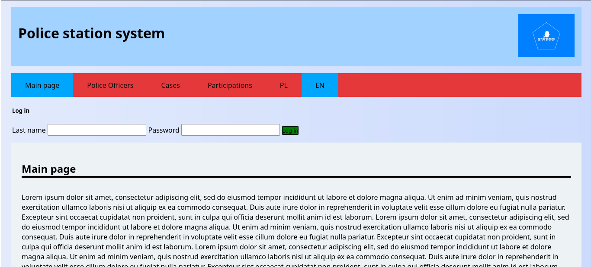
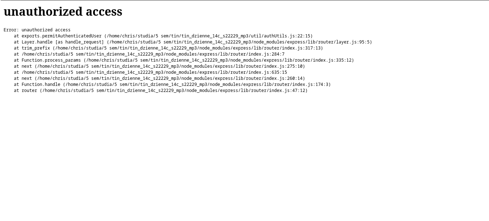

## Police webapp
This app is an Express project with sequelize ORM.
It's using MySQL as a database. Project have sessions implemented,
with a possibility to create a new account. Whole app is internationalized,
Available languages are Polish and English. Below you can find some screens presenting the appearance
of the app.

## Main screen

## Attempt of unauthorized access

