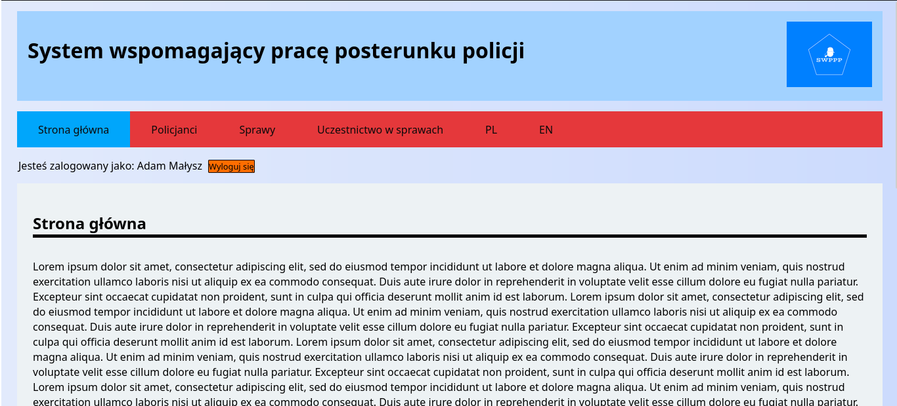
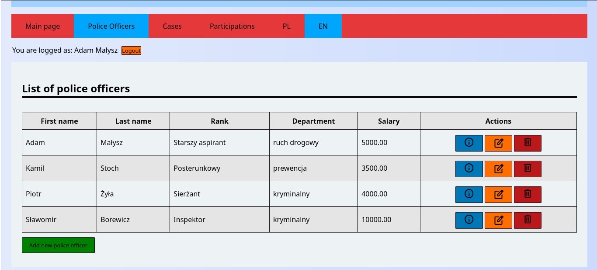
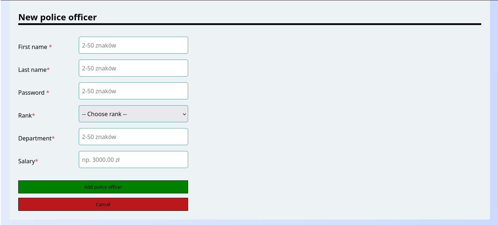
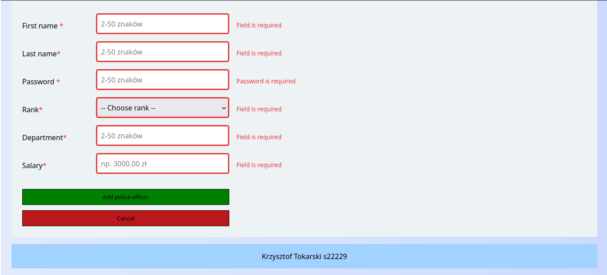
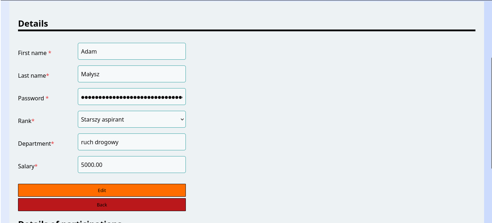

## Police webapp
This app is an Express project with sequelize ORM.
It's using MySQL as a database. Project have sessions implemented,
with a possibility to create a new account. Whole app is internationalized,
Available languages are Polish and English. Below you can find some screens presenting the appearance
of the app.

## Main screen

## Attempt of unauthorized access

## Main screen after successful login 

## List of all police officers registered in system

## Register form for police officers

## Police officer form errors display

## Police officer details

## Other views

Other views for other db tables are similar to those created for police officer table.
Example user for testing the app is Małysz with password 12345. 

